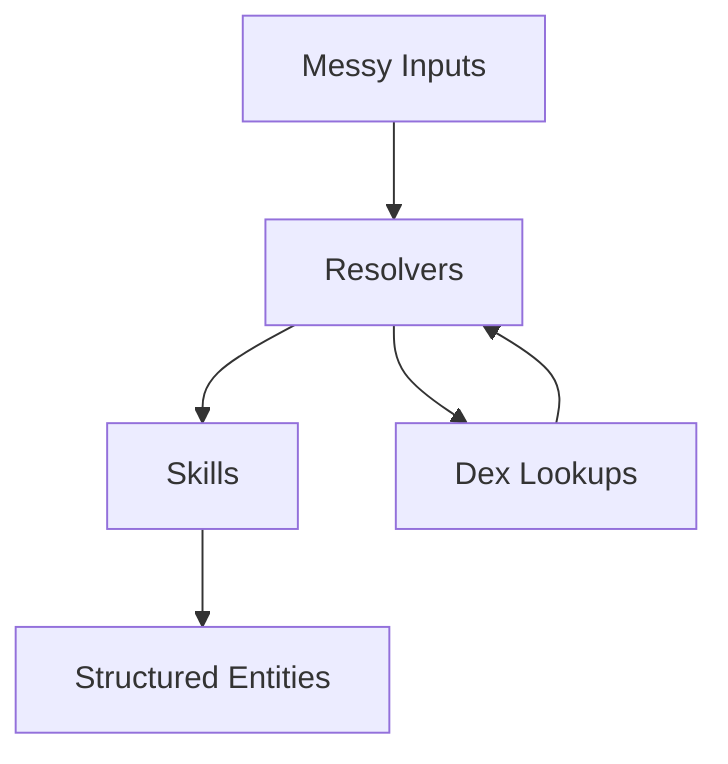

# StashKit Overview

StashKit is a semantic interpretation framework for Python.

You give it messy inputs (text, images, barcodes, logs, whatever) plus a **Dex** that describes your domain.
StashKit coordinates **Resolvers** and **Skills** to turn those inputs into clean, structured entities.

Highlights:

- Dexes are **just data** (JSON) – portable and inspectable
- LexiDex is a **tiny wrapper** – not an engine, just a convenience API
- Resolvers and Skills are the actual **runtime brains**
- BoosterPacks make it easy to add new domains
- The Dex schema is **LLM-aware** via `llm_guidance` and Dex zoning
