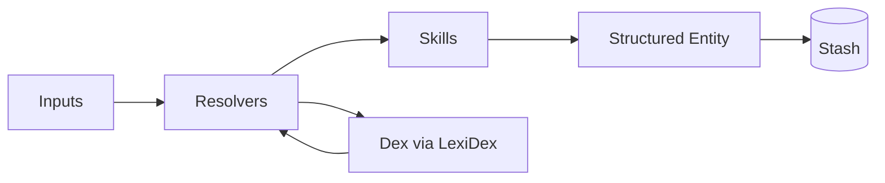

# Architecture

At a high level, StashKit looks like this:

Core layers:

- **Dex** – domain ontology (nodes, aliases, metadata)
- **LexiDex** – wrapper around Dex JSON for safe queries
- **Resolvers** – pipelines that orchestrate Skills and Dex
- **Skills** – small, focused operations (parse, classify, normalize)
- **BoosterPacks** – bundles that ship Dex + resolvers + skills
- **Stash** – optional storage for resolved entities

The Dex schema includes LLM-aware fields so that **the same Dex** can be used:

- at runtime by StashKit
- as a **projection** (MetaDex-style) for LLM priming
