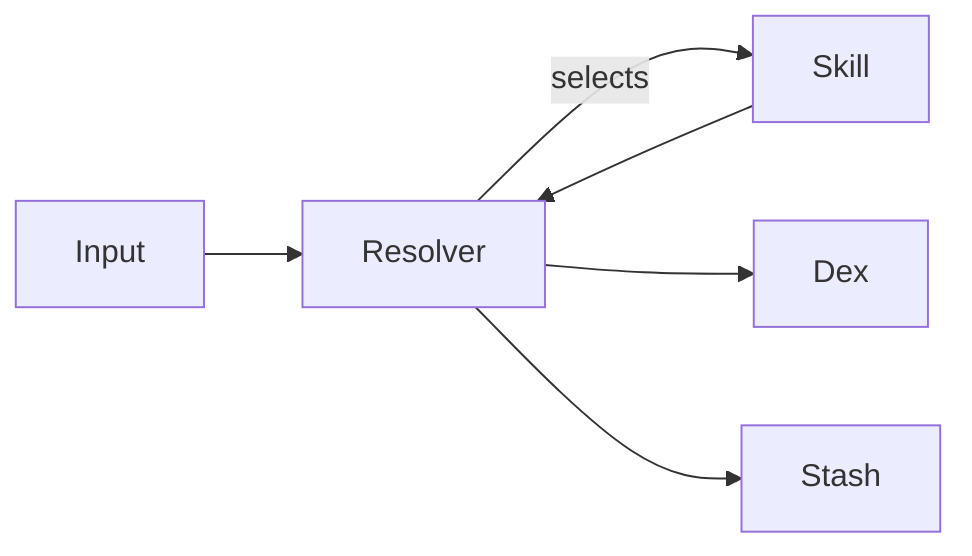

# StashKit Architecture

> **Status:** Foundational — this document describes the core design constraints the system is built around.

StashKit is a framework for turning uncertain, partial, or heterogeneous inputs into **structured identity** through explicit reasoning.

It separates *what things are* from *how we figure them out* and from *where identified things live*.

---

## TL;DR

* **Ontology**: what exists (Dexes, schemas, relationships)
* **Ontogeny**: how identity is resolved (Resolvers + Strategies + Skills)
* **Identity & Storage**: what is considered resolved and where it is kept (Stash)

These concerns are intentionally separate.

---

## Core Components

```mermaid
flowchart LR
    Input --> Resolver
    Resolver -->|selects| Skill
    Skill --> Resolver
    Resolver --> Dex
    Resolver --> Stash
```

### How to read this diagram

* The diagram shows **responsibility flow**, not object ownership.
* Dexes define *meaning*, not behavior.
* Resolvers decide *what to do next*.
* Skills perform *bounded work*.
* The Stash records *resolved identity*.

---

## Ontology (Dexes)

**Dexes** define the *conceptual space* a system operates in.

A Dex describes:

* entities that may exist
* fields those entities may have
* relationships and hierarchies between entities

Dexes are:

* declarative
* inert
* safe to load into both runtime and LLM contexts

### LexiDex

**LexiDex** is the canonical ontology engine.

It provides:

* schema validation
* controlled vocabulary
* structural guarantees

LexiDex exists to prevent accidental mutation of ontology during resolution.

Resolvers may *read from* Dexes, but do not modify them directly.

---

## Ontogeny (Resolvers)

Resolvers are responsible for **turning inputs into identity**.

A Resolver:

* receives a `ResolverState`
* evaluates what information is known
* decides which Skill to invoke next
* merges results back into state
* decides when resolution is sufficient

Resolvers do **not**:

* perform I/O directly
* assert identity on their own
* own Dex data

Resolvers operate via **strategies** (e.g. linear, adaptive) that govern how Skills are selected and revisited.

---

## Skills

Skills are the smallest unit of work in StashKit.

A Skill:

* consumes specific inputs
* produces specific claims
* reports provenance and confidence

Skills are defined by a **SkillDescriptor**, which allows resolvers to reason over *capabilities*, not implementations.

Skills may be:

* shipped with StashKit
* bundled in BoosterPacks
* published independently by third parties

Resolvers select Skills based on descriptors, not on where the Skill originated.

---

## Identity & Storage (Stash)

The **Stash** is where resolved identity is recorded.

Only resolvers decide when an entity is sufficiently resolved to be stashed.

The Stash:

* stores resolved entities
* does not perform inference
* does not modify ontology

This separation ensures that identity decisions are explicit, reviewable, and reproducible.

---

## BoosterPacks

BoosterPacks are **composition units**.

A BoosterPack may include:

* Dex overlays
* Resolver subclasses
* Skill bundles
* configuration defaults

BoosterPacks do not change StashKit’s core contracts.
They specialize behavior by composition, not inheritance.

---

## Design Constraints (Why This Separation Exists)

StashKit is built around a few non-negotiable design constraints:

* Ontology must be explicit and inspectable
* Resolution must be observable and interruptible
* Identity decisions must be deliberate
* Extension must not require modification of core code

These constraints exist to support:

* human reasoning
* machine reasoning
* auditability
* long-lived systems

---

## Summary

StashKit is not a pipeline.

It is a framework for **reasoned identity formation** built on clear separation of concerns:

* Ontology defines meaning
* Ontogeny discovers identity
* Storage records decisions

Everything else is implementation detail.
