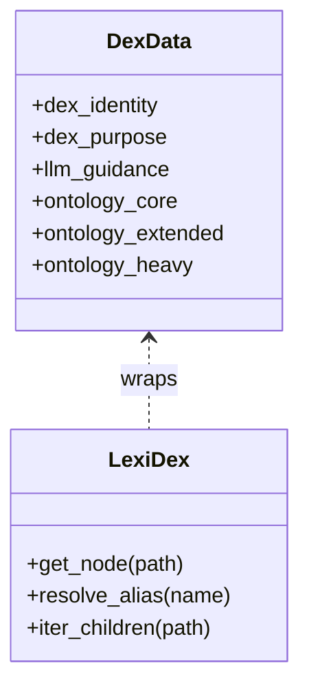

# Dex and LexiDex

A **Dex** is a JSON file describing a domain ontology. It contains:

- `dex_identity` – name, version, profile
- `dex_purpose` – what this Dex is for
- `llm_guidance` – how LLMs should use (or *not* use) it
- optional signing/licensing metadata
- one or more ontology zones:
  - `ontology_core`
  - `ontology_extended`
  - `ontology_heavy`

LexiDex is a small Python class that wraps a Dex dict:

```python
from stashkit.lexidex import Dex

with open("boozedex.json") as f:
    data = json.load(f)

booze_dex = Dex(data)
node = booze_dex.get_node("spirits.whiskey")
```

Conceptually:



LexiDex **does not** perform resolution. That is the job of Resolvers and Skills.
