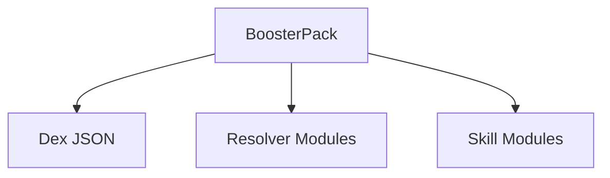

# BoosterPacks

A **BoosterPack** is how you ship a domain into StashKit.

A BoosterPack typically contains:

- one or more Dex files (JSON)
- resolver classes
- skill classes
- optional configuration / manifests



API sketch:

```python
from stashkit import use_booster_pack

booze = use_booster_pack("BoozeDex")
entity = booze.resolve("photo-of-bottle.jpg")
```

`use_booster_pack()`:

- loads the Dex JSON
- wraps it in a LexiDex instance or Dex subclass
- registers resolvers and skills
- returns a handle that exposes `resolve()` as a convenience
