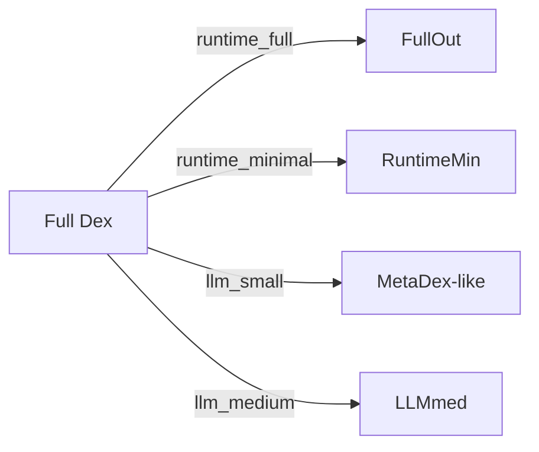

# Dex Compiler and Build Profiles

The Dex Compiler transforms a full Dex into different **profiles**:

- `runtime_full` – everything, used by StashKit
- `runtime_minimal` – lighter runtime version
- `llm_small` – only `ontology_core`
- `llm_medium` – `ontology_core` + `ontology_extended`
- `documentation` – human-friendly dump

The compiler consults:

- `llm_guidance`
- `dex_boundaries`
- Dex zoning (`ontology_core`, `ontology_extended`, `ontology_heavy`)

to decide what to keep, what to drop, and what to annotate for LLMs.
